# Assignment #3 - Cats Generator Playground

In this assignment, we will train GANs. This assignment includes two parts: in the first part, we will implement a specific type of GAN designed to process images, called a Deep Convolutional GAN (DCGAN). We will train the DCGAN to generate grumpy cats from samples of random noise. In the second part, we will implement a more complex GAN architecture called CycleGAN for the task of image-to-image translation (described in more detail in Part 2). We will train the CycleGAN to convert between different types of two kinds of cats (Grumpy and Russian Blue), and between apples and oranges. In both parts, you will gain experience implementing GANs by writing code for the generator, discriminator, and training loop, for each model. 


## Part 1: Deep Convolutional GAN

### Implement Data Augmentation

For deluxe data augmentation I added random horizontal and vertical crops. Additionally, I added a random rotation of 10 degrees as well. 

```python
deluxe_transform = transforms.Compose([
        transforms.Resize(opts.image_size, Image.BICUBIC),
        transforms.RandomHorizontalFlip(),
        transforms.RandomCrop(opts.image_size),
        transforms.RandomRotation(10),
        transforms.ToTensor(),
        transforms.Normalize((0.5, 0.5, 0.5), (0.5, 0.5, 0.5)),
    ])
```

### Implement the Discriminator of the DCGAN

#### Padding calculation for Discriminator

1. Padding: In each of the convolutional layers for the DCGAN, we downsample the spatial dimension of the input volume by a factor of 2. Given that we use kernel size K = 4 and stride S = 2. For padding we use the below formula, 
   $$
   Given, I = input size, K = kernel size, S = stride, O = output size, P = padding$$
   $$

   $$
   O = \frac{I - K + 2P}{2} -1
   $$

   If we calculate the padding for all layers using this formula, 

   - padding for `conv1`: **1** 
   - padding for `conv2`: **1** 
   - padding for `conv3`: **1** 
   - padding for `conv4`: **1** 
   - padding for `conv5`: **0**

#### **Discriminator and Generator Training Losses** 


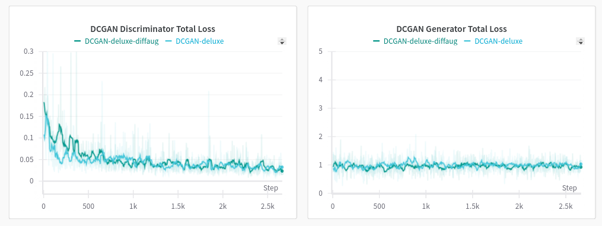

If the GAN needs to be trained, the losses should not converge.  The same happens in our case and which implies our models are trained well. 

As we can see above, using Differential Augmentation helps the generator to converge faster. In both basic and deluxe cases, the using differential augmentation generator loss is stable compared to the other case.   


#### **Samples** 

| Iteration |                            basic                             |                            deluxe                            |                       deluxe + diffaug                       |
| :-------: | :----------------------------------------------------------: | :----------------------------------------------------------: | :----------------------------------------------------------: |
|    200    |  |  |  |
|   6400    |  |  | 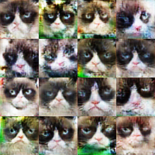 |


## Part 2: CycleGAN

#### Early Experiments

###### Training iterations: 1000

| Iteration |                        X-Y Generator                         |                        Y-X Generator                         |
| :-------: | :----------------------------------------------------------: | :----------------------------------------------------------: |
|   1000    |  | 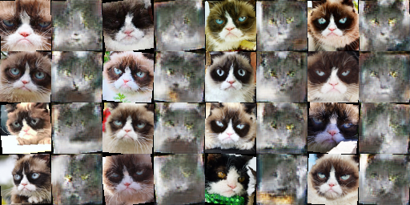 |

###### Training iterations: 1000 with cycle consistency loss 

| Iteration |                        X-Y Generator                         |                        Y-X Generator                         |
| :-------: | :----------------------------------------------------------: | :----------------------------------------------------------: |
|   1000    |  | 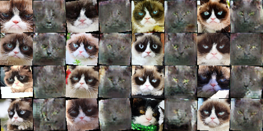 |


#### Training with cats data 10000 iterations 

###### Training iterations: 10000 

| Iteration |                        X-Y Generator                         |                        Y-X Generator                         |
| :-------: | :----------------------------------------------------------: | :----------------------------------------------------------: |
|   10000   |  |  |

###### Training iterations: 10000 with cycle consistency loss 

| Iteration |                        X-Y Generator                         |                        Y-X Generator                         |
| :-------: | :----------------------------------------------------------: | :----------------------------------------------------------: |
|   10000   |  | 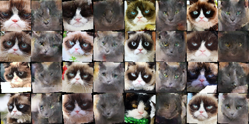 |


#### Training with fruits data 

###### Training iterations: 10000 

| Iteration |                        X-Y Generator                         |                        Y-X Generator                         |
| :-------: | :----------------------------------------------------------: | :----------------------------------------------------------: |
|   1000    |  | 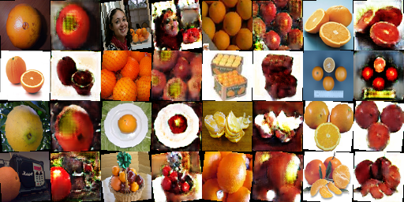 |

###### Training iterations: 10000 with cycle consistency loss 

| Iteration |                        X-Y Generator                         |                        Y-X Generator                         |
| :-------: | :----------------------------------------------------------: | :----------------------------------------------------------: |
|   1000    |  | 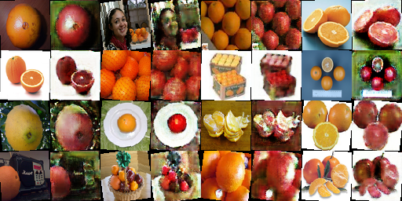 |


#### Do you notice a difference between the results with and without the cycle consistency loss? 

Yes the results with and without cycle consistency loss is noticeable. With cycle consistency loss images seem to be more sharp while translating the important features well, but without the cycle consistency loss the generated images look blurry and the translation seems lo look half baked. 


#### Comparison between Patch Discriminator vs DC Discriminator 

As we can see below, when we are using DC Discriminator image translations are a little worse compared to Patch Discriminator. This is because Patch Discriminator uses local features (turns the image into 4 * 4 patches) while DC Discriminator uses the entire image (as 1 patch). 

Generating the blue cats (cat A) seems to be bad because the original cat B image seems to have sharp features across the image which are not being able to transfer to the generated image, which makes the generated cats a little blurry.        

###### Training iterations: 10000 with cats data with DC Discriminator 

| Iteration |                        X-Y Generator                         |                        Y-X Generator                         |
| :-------: | :----------------------------------------------------------: | :----------------------------------------------------------: |
|   10000   |  | 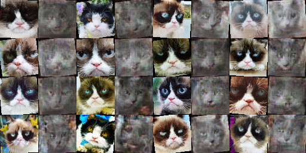 |

###### Training iterations: 10000 with fruits data with DC Discriminator 

| Iteration |                        X-Y Generator                         |                        Y-X Generator                         |
| :-------: | :----------------------------------------------------------: | :----------------------------------------------------------: |
|   1000    | 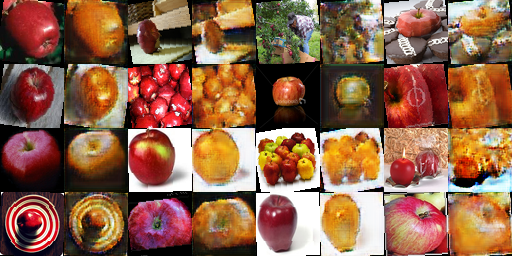 | 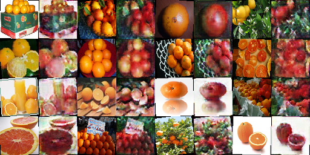 |


## Bells & Whistles 

Below are some generated samples using **OOTDiffusion** from hugging face. 

|     Model (Input)      |    Garment (Input)     |         Output         |
| :--------------------: | :--------------------: | :--------------------: |
| 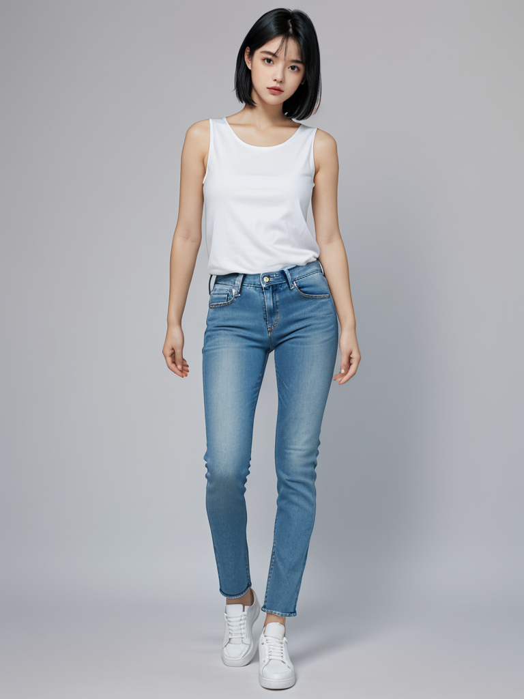 | 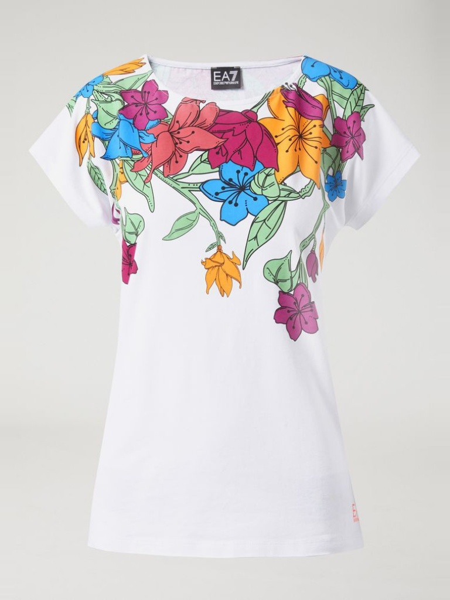 |  |
|  |  | 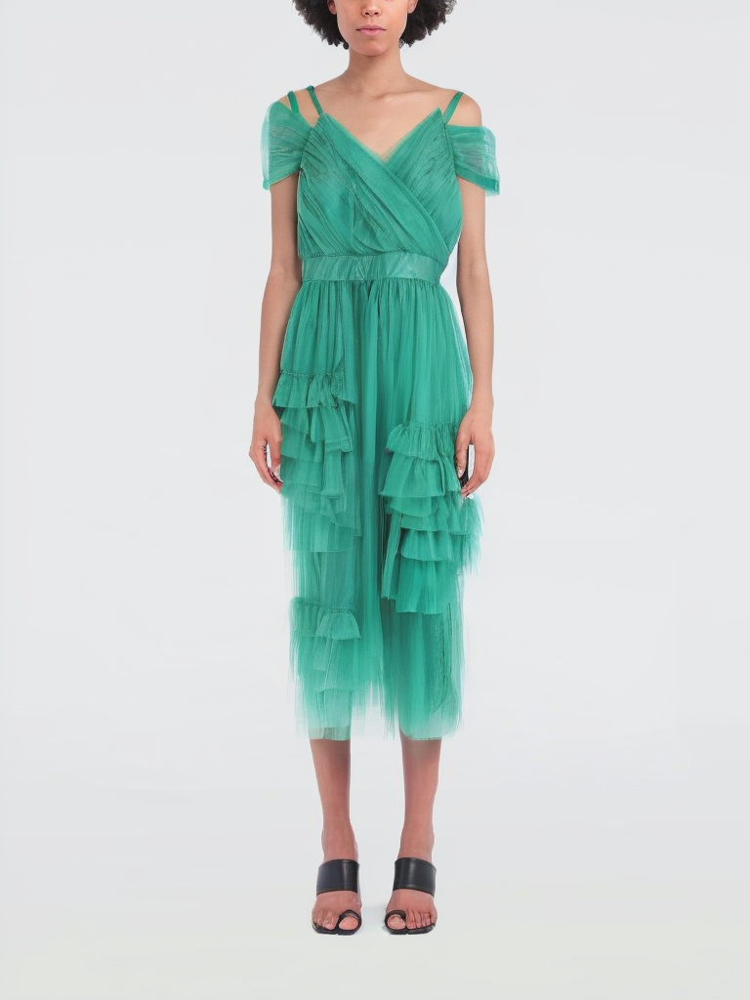 |


